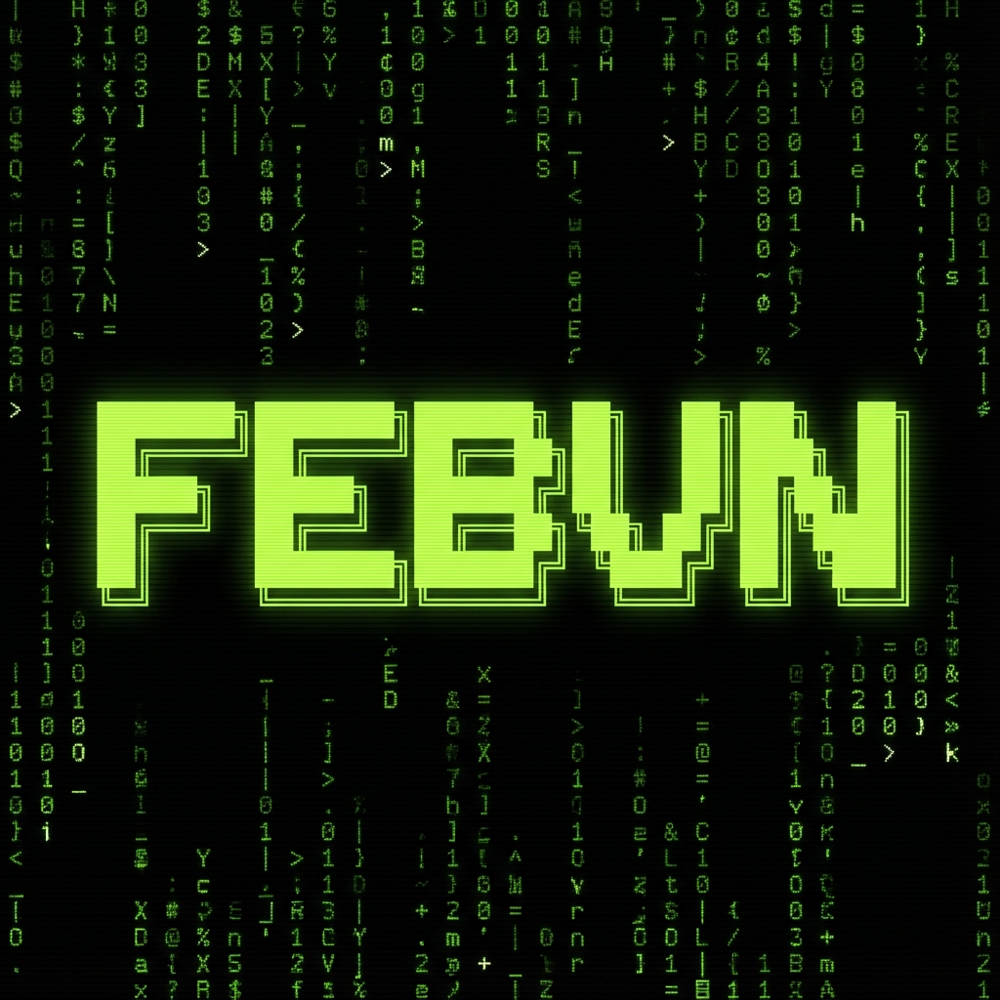

# 📟 SYSTEM.ACCESS(FEBRIAN) 📟

---

### 🟢 USER IDENTIFICATION

  
  
  

> 🎓 **Computer Science Student at ITERA** (Institut Teknologi Sumatera)  
> ✉️ **Reach Me:** [dodithalud01@gmail.com](mailto:dodithalud01@gmail.com)

---

## 💾 TECH_STACK.EXE (NEON_PROTOCOL)

  <!-- Bahasa Pemrograman -->
  
  
  
  
  <!-- Web -->
  
  
  

  <!-- Tools -->
  
  
  

---

## 👾 PROTOCOL: PAC-MAN (V0.1-BETA)
<!-- Pacman Animation with Matrix Green feel -->
<svg width="100%" height="100" viewBox="0 0 800 100" xmlns="http://www.w3.org/2000/svg">
  <rect width="800" height="100" fill="#000000" rx="0"/>
  
  <!-- Food Bits (Pixel Style) -->
  <rect x="100" y="48" width="4" height="4" fill="#00FF00"><animate attributeName="opacity" values="1;0;1" dur="2s" begin="0.2s" repeatCount="indefinite" /></rect>
  <rect x="200" y="48" width="4" height="4" fill="#00FF00"><animate attributeName="opacity" values="1;0;1" dur="2s" begin="0.4s" repeatCount="indefinite" /></rect>
  <rect x="300" y="48" width="4" height="4" fill="#00FF00"><animate attributeName="opacity" values="1;0;1" dur="2s" begin="0.6s" repeatCount="indefinite" /></rect>
  <rect x="400" y="48" width="4" height="4" fill="#00FF00"><animate attributeName="opacity" values="1;0;1" dur="2s" begin="0.8s" repeatCount="indefinite" /></rect>
  <rect x="500" y="48" width="4" height="4" fill="#00FF00"><animate attributeName="opacity" values="1;0;1" dur="2s" begin="1.0s" repeatCount="indefinite" /></rect>
  <rect x="600" y="48" width="4" height="4" fill="#00FF00"><animate attributeName="opacity" values="1;0;1" dur="2s" begin="1.2s" repeatCount="indefinite" /></rect>
  <rect x="700" y="48" width="4" height="4" fill="#00FF00"><animate attributeName="opacity" values="1;0;1" dur="2s" begin="1.4s" repeatCount="indefinite" /></rect>

  <!-- Pacman (Green Block Style) -->
  <g>
    <path fill="#00FF00" d="M25,25 L45,10 A20,20 0 1,1 45,40 Z">
      <animateTransform attributeName="transform" type="translate" from="-50 25" to="850 25" dur="6s" repeatCount="indefinite" />
      <animate attributeName="d" values="M25,25 L45,10 A20,20 0 1,1 45,40 Z; M25,25 L45,25 A20,20 0 1,1 45,25 Z; M25,25 L45,10 A20,20 0 1,1 45,40 Z" dur="0.2s" repeatCount="indefinite" />
    </path>
  </g>

  <!-- Glitch Ghost -->
  <g>
    <path fill="#008000" d="M15,10 Q15,0 25,0 Q35,0 35,10 L35,25 L31,22 L27,25 L23,22 L19,25 L15,22 Z">
       <animateTransform attributeName="transform" type="translate" from="-150 40" to="750 40" dur="6s" repeatCount="indefinite" />
    </path>
    <rect width="4" height="4" fill="black"><animateTransform attributeName="transform" type="translate" from="-130 45" to="770 45" dur="6s" repeatCount="indefinite" /></rect>
    <rect width="4" height="4" fill="black"><animateTransform attributeName="transform" type="translate" from="-140 45" to="760 45" dur="6s" repeatCount="indefinite" /></rect>
  </g>
</svg>

---

## 📊 CORE_STATS.LOG

  
   
  
   
  

---

## 📽️ LIVE_FEED.SH

  <marquee scrollamount="8" behavior="scroll" direction="left" style="font-family: 'Courier New', Courier, monospace; color: #00FF00; background: #000000; padding: 10px; border: 1px solid #00FF00;">
    [SYSTEM INFO]: SCANNING ARCHIVES... ITERA STUDENT DATA DETECTED: FEBRIAN... PACMAN PROTOCOL ACTIVE... THE MATRIX IS WATCHING...
  </marquee>

---

  

